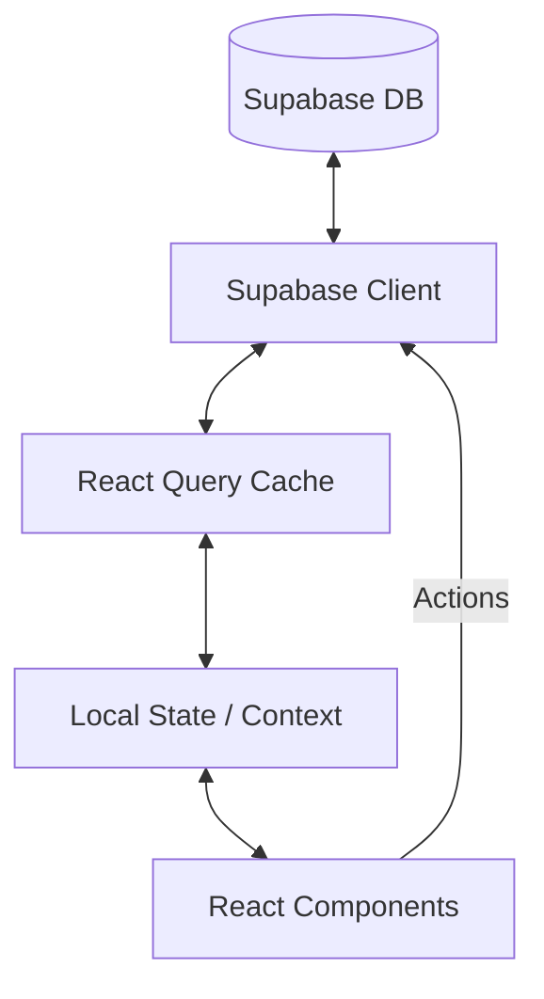

# Data Flow Architecture

## Overview
This document outlines the data flow within the FloraIQ platform, detailing how data moves from the database to the user interface.

## Architecture

## 1. Data Source (Supabase)
- **Database**: PostgreSQL hosted on Supabase.
- **Realtime**: Subscriptions for live updates (e.g., Orders, Notifications).
- **Security**: Row Level Security (RLS) policies enforce data access at the database level.

## 2. Data Fetching (TanStack Query)
We use **TanStack Query (React Query)** as the primary server state manager.
- **Hooks**: Custom hooks (e.g., `useOrders`, `useProducts`) encapsulate data fetching logic.
- **Caching**: Data is cached in memory to reduce network requests.
- **Stale-While-Revalidate**: UI shows cached data while fetching fresh data in the background.

## 3. State Management
- **Server State**: Managed by React Query (90% of app state).
- **Client State**:
  - **Context API**: For global app state (Auth, Theme, Toast).
  - **Local State**: `useState` / `useReducer` for component-specific UI state.
  - **URL State**: Search params for filters and pagination (shareable URLs).

## 4. Data Mutation
1. **User Action**: User triggers an action (e.g., "Create Order").
2. **Optimistic Update**: UI updates immediately (optional, for better UX).
3. **API Request**: Mutation sent to Supabase.
4. **Invalidation**: On success, relevant React Query keys are invalidated.
5. **Refetch**: Fresh data is fetched to ensure consistency.

## 5. Realtime Updates
- **Subscriptions**: Components subscribe to table changes via Supabase Realtime.
- **Integration**: Realtime events trigger React Query invalidations or direct cache updates.

## Best Practices
- **Colocation**: Keep data fetching logic close to where it's used.
- **Keys**: Use structured Query Keys (e.g., `['orders', { status: 'pending' }]`).
- **Prefetching**: Prefetch data for anticipated user actions (e.g., hovering over a link).
